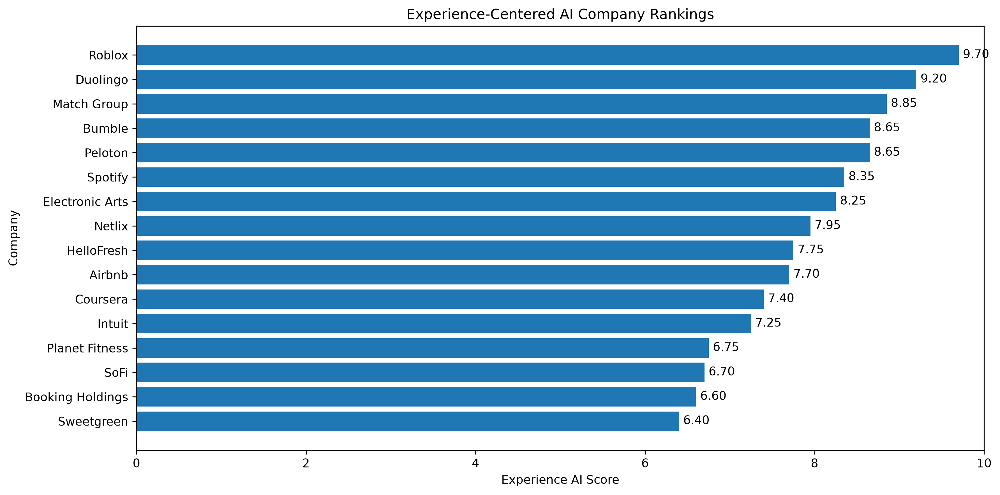
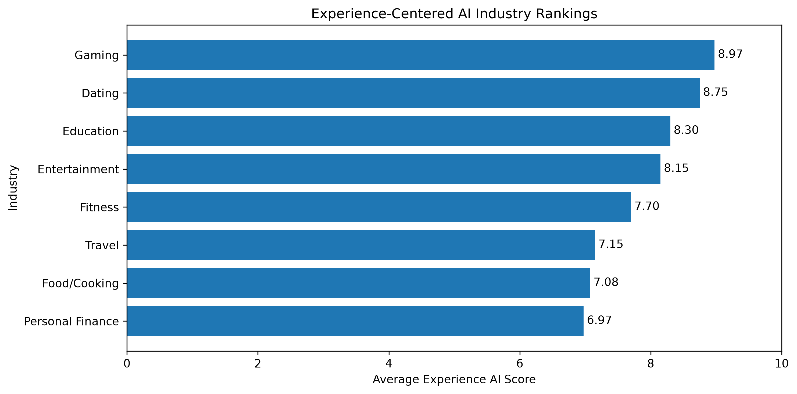
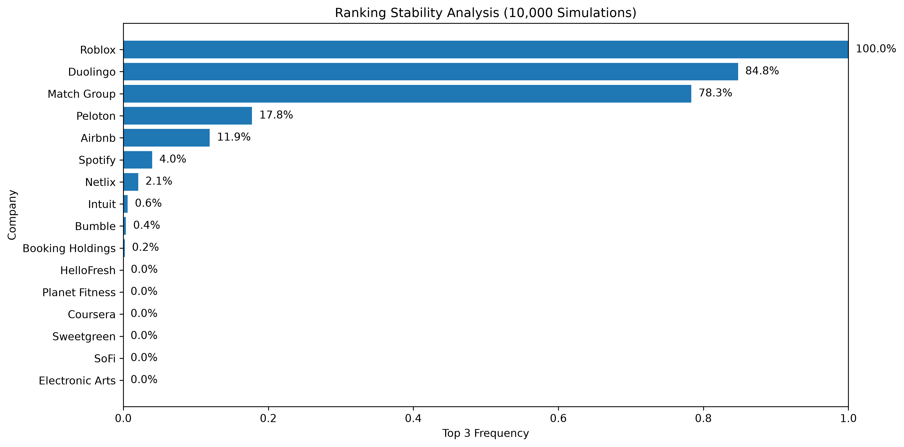
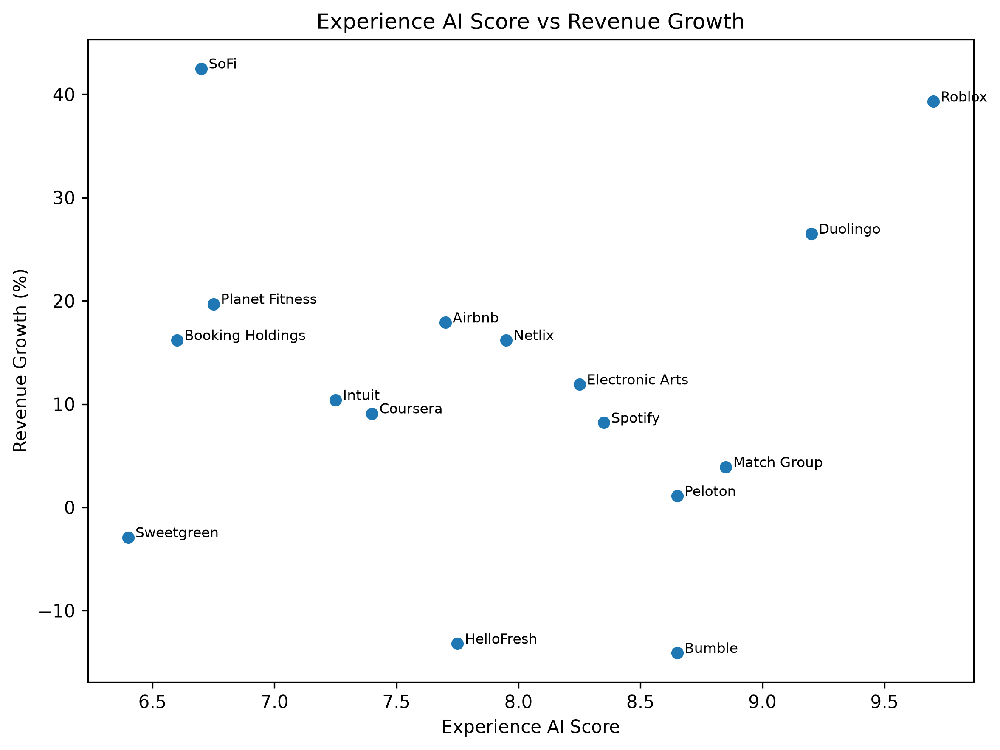
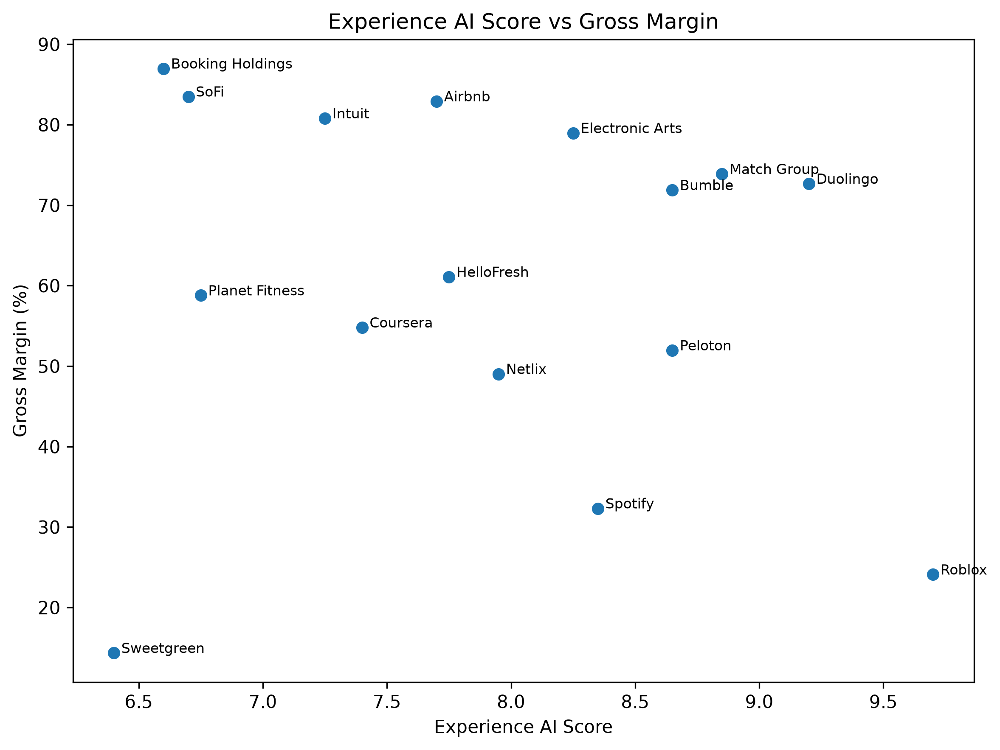

# Experience-Centered AI: An Alternative Framework for Evaluating AI Opportunities

## Overview

Traditional AI analysis often focuses on automation, labor replacement, and efficiency gains.

This project explores an alternative hypothesis:

> The largest long-term AI opportunities may emerge not from replacing human participation, but from enhancing it.

The Experience-Centered AI Framework evaluates companies based on their ability to use AI to increase engagement, personalization, mastery, discovery, creativity, and user agency while preserving human participation.

---

## Project Highlights

- Designed a custom AI investment framework evaluating 16 companies across 8 industries.
- Built a weighted scoring model using six strategic dimensions.
- Conducted Monte Carlo simulation with 10,000 randomized weighting scenarios.
- Automated financial metric collection using Yahoo Finance APIs.
- Performed financial overlay analysis to compare strategic alignment against traditional business performance.
- Generated ranking visualizations, industry analyses, and robustness testing outputs using Python.

---

## Analysis Workflow

1. Develop Experience-Centered AI scoring framework
2. Score companies across six dimensions
3. Generate company and industry rankings
4. Test ranking robustness using Monte Carlo simulation
5. Collect financial metrics using Yahoo Finance
6. Compare framework scores against business performance
7. Evaluate whether Experience AI alignment represents a distinct strategic factor

---

## Framework Dimensions

| Factor | Weight |
|----------|----------|
| Experience Intensity | 25% |
| AI Enhancement Potential | 20% |
| Repeat Usage Potential | 20% |
| Agency Preservation | 15% |
| Revenue Capture Potential | 10% |
| Network Effects | 10% |

---

## Industries Evaluated

- Gaming
- Education
- Fitness
- Personal Finance
- Travel
- Entertainment
- Food & Cooking
- Dating

---

## Company Rankings



### Top 5 Companies

| Rank | Company | Score |
|--------|--------|--------|
| 1 | Roblox | 9.70 |
| 2 | Duolingo | 9.20 |
| 3 | Match Group | 8.85 |
| 4 | Peloton | 8.65 |
| 5 | Bumble | 8.65 |

---

## Industry Rankings



### Industry Results

| Rank | Industry | Average Score |
|--------|--------|--------|
| 1 | Gaming | 8.98 |
| 2 | Dating | 8.75 |
| 3 | Education | 8.30 |
| 4 | Entertainment | 8.15 |
| 5 | Fitness | 7.70 |
| 6 | Travel | 7.15 |
| 7 | Food & Cooking | 7.08 |
| 8 | Personal Finance | 6.98 |

---

## Initial Findings

The highest-scoring companies consistently demonstrated:

- Strong engagement loops
- High repeat participation
- Personalization opportunities
- Preserved user agency
- Identity or mastery-based experiences
- Scalable monetization models

Examples include Roblox, Duolingo, Match Group, and Peloton.

---

## Sensitivity Analysis

To test whether rankings depended on a specific weighting scheme, a Monte Carlo simulation was conducted using 10,000 randomized weighting combinations.



### Most Stable Rankings

| Company | Average Rank | Top 3 Frequency |
|----------|----------|----------|
| Roblox | 1.06 | 100.0% |
| Duolingo | 2.55 | 84.8% |
| Match Group | 2.98 | 78.3% |

### Key Takeaways

- Roblox remained a Top 3 company in every simulation.
- Duolingo remained Top 3 in nearly 85% of simulations.
- Match Group remained Top 3 in over 78% of simulations.
- Results appear driven by structural characteristics rather than specific model assumptions.

---

## Financial Overlay Analysis

Financial metrics were collected automatically using Yahoo Finance and compared against Experience AI Scores.

### Financial Metrics

- Market Capitalization
- Revenue Growth
- Gross Margin
- Operating Margin

### Revenue Growth Comparison



### Gross Margin Comparison



### Financial Findings

The Experience AI Score exhibited minimal correlation with:

- Market Capitalization
- Revenue Growth
- Gross Margin
- Operating Margin

This suggests the framework measures a strategic dimension that is largely independent of traditional financial performance.

Notable observations:

- Roblox combined the highest framework score with the strongest growth profile.
- Duolingo demonstrated both strong framework alignment and strong business performance.
- SoFi exhibited strong growth despite a moderate framework score.
- Booking Holdings demonstrated exceptional profitability despite lower framework alignment.

The results suggest that the framework may capture future strategic positioning rather than current financial performance.

---

## Project Structure

```text
experience-centered-ai/

├── charts/
│   ├── company_rankings.png
│   ├── industry_rankings.png
│   ├── ranking_stability.png
│   ├── score_vs_revenue_growth.png
│   └── score_vs_gross_margin.png
│
├── data/
│   ├── raw/
│   │   ├── scoring.csv
│   │   └── financial_metrics.csv
│   │
│   └── outputs/
│       ├── company_rankings.csv
│       ├── industry_rankings.csv
│       ├── industry_factor_scores.csv
│       ├── ranking_stability_summary.csv
│       ├── ranking_stability_simulations.csv
│       ├── financial_overlay.csv
│       └── financial_correlation_matrix.csv
│
├── notebooks/
│   ├── 01_load_and_clean.ipynb
│   ├── 02_rankings_and_visuals.ipynb
│   ├── 03_sensitivity_analysis.ipynb
│   └── 04_financial_analysis.ipynb
│
├── scripts/
│   ├── scoring_utils.py
│   └── visualization.py
│
├── sql/
│   └── schema.sql
│
├── requirements.txt
└── README.md
```
## Technologies Used

- Python
- Pandas
- NumPy
- Matplotlib
- Jupyter Notebook
- SQL
- yfinance

---

## Key Project Outputs

### Visualizations

- Company Rankings
- Industry Rankings
- Monte Carlo Ranking Stability
- Experience AI Score vs Revenue Growth
- Experience AI Score vs Gross Margin

### Datasets Generated

- company_rankings.csv
- industry_rankings.csv
- industry_factor_scores.csv
- ranking_stability_summary.csv
- ranking_stability_simulations.csv
- financial_overlay.csv
- financial_correlation_matrix.csv

---

## Financial Findings

The financial overlay was designed to evaluate whether companies that score highly under the Experience-Centered AI framework also demonstrate strong traditional business performance.

The analysis found that Experience AI Scores exhibited minimal correlation with market capitalization, revenue growth, gross margin, and operating margin within the sample. Correlation coefficients between the framework score and financial metrics were all close to zero, suggesting that the framework is measuring a strategic dimension distinct from conventional financial performance indicators.

Several high-scoring companies nevertheless demonstrated strong business results. Roblox achieved the highest overall Experience AI Score while also exhibiting the strongest revenue growth rate in the sample. Duolingo similarly combined a high framework score with strong growth and attractive margins, making it one of the clearest examples of alignment between the Experience-Centered AI thesis and current business success.

At the same time, the analysis identified multiple counterexamples. SoFi displayed one of the strongest revenue growth rates in the sample despite receiving a more moderate Experience AI Score. Booking Holdings achieved exceptional profitability metrics while ranking lower on the framework. These cases suggest that strong financial performance can emerge through business models that are not necessarily optimized for participation, agency preservation, mastery, or engagement.

The results therefore indicate that the Experience-Centered AI framework is not simply a proxy for growth investing, profitability, or company size. Instead, it appears to capture a distinct hypothesis regarding how AI may create value by enhancing human participation rather than replacing it.

From an investment perspective, the framework may be most useful as a complementary lens rather than a replacement for traditional financial analysis. Financial metrics evaluate current business performance, while the Experience AI Score attempts to evaluate strategic positioning within a future AI-driven economy.

Overall, the financial analysis provides preliminary evidence that the framework identifies characteristics that are largely independent of current financial outcomes. Further research using larger company samples, additional industries, and longer-term performance data would be required to determine whether strong Experience AI alignment ultimately translates into superior long-term shareholder value.

---

## Limitations

- Company selection is intentionally small and exploratory.
- Scores rely on structured qualitative judgment.
- Framework weights reflect a specific strategic thesis.
- Financial analysis uses a limited cross-sectional sample.
- Results should be interpreted as directional rather than predictive.
- The framework evaluates strategic positioning, not intrinsic company valuation.

---

## Future Improvements

Potential future extensions include:

- Expanding the company universe to 100+ firms
- Adding healthcare, creator economy, enterprise software, and social media sectors
- Historical stock return testing
- Factor regression analysis
- Automated scoring pipelines
- Dashboard development with Power BI or Tableau
- Public-company screening tool
- Alternative weighting frameworks
- Longitudinal tracking of Experience AI Scores over time

---

## Career Relevance

This project demonstrates:

- Framework design and operationalization
- Quantitative scoring methodology
- Exploratory data analysis
- Monte Carlo simulation
- Financial analysis
- Data visualization
- SQL schema design
- Python-based analytics workflows
- Business strategy evaluation

The project was designed to showcase the intersection of analytics, business strategy, and emerging AI trends.

---

## Why This Matters

Most AI analyses focus on efficiency and automation.

This project explores whether future value creation may increasingly come from AI systems that enhance human participation, engagement, creativity, learning, and identity rather than replacing human activity altogether.

The framework provides a structured methodology for testing that hypothesis.

---

## Conclusion

The Experience-Centered AI Framework proposes an alternative perspective on AI value creation.

Rather than focusing exclusively on automation and efficiency, the framework evaluates how AI can enhance participation, agency, mastery, creativity, discovery, and engagement.

Initial findings suggest that companies such as Roblox, Duolingo, and Match Group may be particularly well positioned if future AI adoption increasingly revolves around augmenting human experiences rather than replacing them.

While exploratory, the framework provides a structured methodology for evaluating AI opportunities through the lens of experience enhancement and human participation. Future research with larger samples and historical performance testing may help determine whether Experience AI alignment ultimately translates into durable competitive advantage and long-term shareholder value.

---

## About the Author

Trevor Reader is a data analyst and operations-focused problem solver with a B.A. in Mathematics and Statistics from the University of Florida.

His interests include:

- Data Analytics
- Business Intelligence
- Operations Analysis
- Artificial Intelligence Strategy
- Decision Science
- Behavioral Economics

This project was developed as an independent research initiative exploring how AI may create value through participation, engagement, agency preservation, and experience enhancement rather than pure automation.

### Connect

LinkedIn:
https://www.linkedin.com/in/trevor-reader

GitHub:
https://github.com/treader-analytics